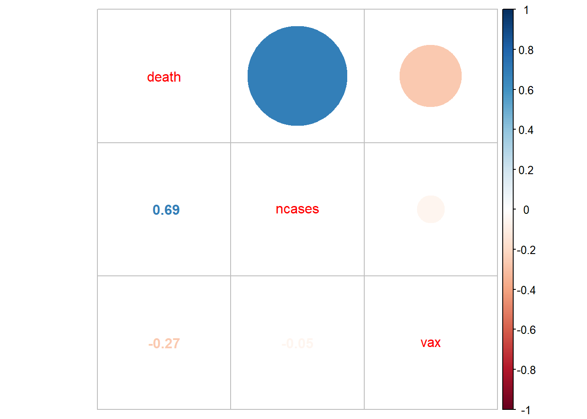
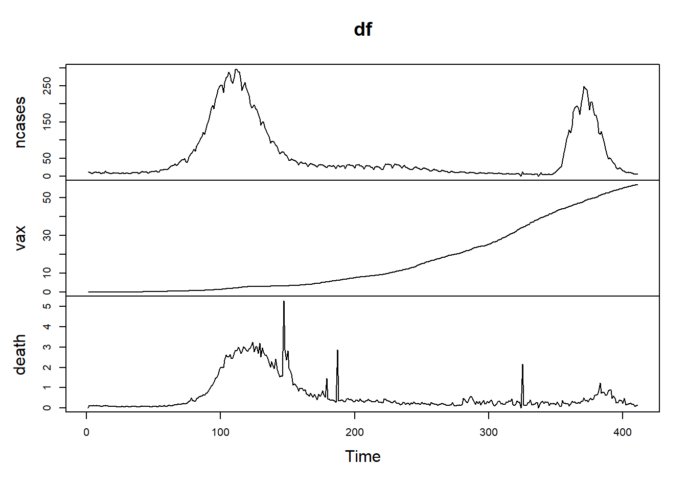
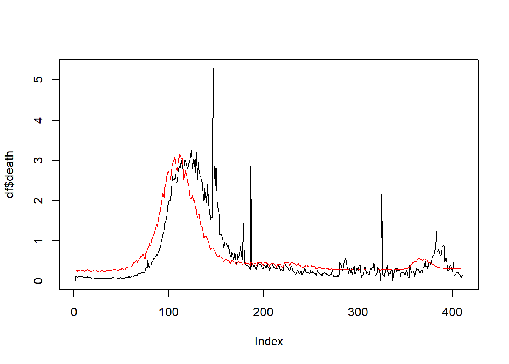

## Reading data


```r
library(readr)
vaccinations <- read_csv("data/vaccinations.csv",show_col_types = FALSE)
newCases <- read_csv("data/new_cases_per_million.csv",show_col_types = FALSE)
deaths <- read_csv("data/total_deaths_per_million.csv",show_col_types = FALSE)
```

## Subsetting the Data

### Note : 

new cases and deaths are taken per million and vaccinations are taken per 100


```r
ind <-vaccinations[vaccinations[1]=="India",]
vaxIndia <- data.frame(ind$date,ind$people_fully_vaccinated_per_hundred)
summary(vaxIndia)
```

```
##     ind.date          ind.people_fully_vaccinated_per_hundred
##  Min.   :2021-01-15   Min.   : 0.000                         
##  1st Qu.:2021-04-27   1st Qu.: 2.975                         
##  Median :2021-08-08   Median :10.220                         
##  Mean   :2021-08-08   Mean   :18.116                         
##  3rd Qu.:2021-11-18   3rd Qu.:31.600                         
##  Max.   :2022-03-01   Max.   :56.820                         
##                       NA's   :40
```

```r
newCasesIndia <- data.frame(newCases$date,newCases$India)
summary(newCasesIndia)
```

```
##  newCases.date        newCases.India   
##  Min.   :2020-01-22   Min.   :  0.000  
##  1st Qu.:2020-08-12   1st Qu.:  6.331  
##  Median :2021-03-03   Median : 18.277  
##  Mean   :2021-03-03   Mean   : 38.370  
##  3rd Qu.:2021-09-22   3rd Qu.: 39.017  
##  Max.   :2022-04-13   Max.   :297.248  
##                       NA's   :8
```

```r
deathsIndia <- data.frame(deaths$date,deaths$India)
summary(deathsIndia)
```

```
##   deaths.date          deaths.India    
##  Min.   :2020-01-22   Min.   :  0.001  
##  1st Qu.:2020-08-12   1st Qu.: 61.222  
##  Median :2021-03-03   Median :116.044  
##  Mean   :2021-03-03   Mean   :179.133  
##  3rd Qu.:2021-09-22   3rd Qu.:322.468  
##  Max.   :2022-04-13   Max.   :374.432  
##                       NA's   :49
```


## Cleaning Data 

### Na values

As we can see there are Na values in the data and timelines don't algin correctly we can fill na with previous know values since this is a time series data so we fill na with previous known values and remaining na with 0


```r
fill.NAs <- function(x) {is_na<-is.na(x); x[Reduce(function(i,j) if (is_na[j]) i else j, seq_len(length(x)), accumulate=T)]}
vaxIndia$ind.people_fully_vaccinated_per_hundred <- fill.NAs(vaxIndia$ind.people_fully_vaccinated_per_hundred)
vaxIndia[is.na(vaxIndia)] = 0
summary(vaxIndia)
```

```
##     ind.date          ind.people_fully_vaccinated_per_hundred
##  Min.   :2021-01-15   Min.   : 0.000                         
##  1st Qu.:2021-04-27   1st Qu.: 1.725                         
##  Median :2021-08-08   Median : 8.110                         
##  Mean   :2021-08-08   Mean   :16.474                         
##  3rd Qu.:2021-11-18   3rd Qu.:27.975                         
##  Max.   :2022-03-01   Max.   :56.820
```

```r
newCasesIndia$newCases.India <- fill.NAs(newCasesIndia$newCases.India)
newCasesIndia[is.na(newCasesIndia)] = 0 
summary(newCasesIndia)
```

```
##  newCases.date        newCases.India   
##  Min.   :2020-01-22   Min.   :  0.000  
##  1st Qu.:2020-08-12   1st Qu.:  6.059  
##  Median :2021-03-03   Median : 18.051  
##  Mean   :2021-03-03   Mean   : 37.992  
##  3rd Qu.:2021-09-22   3rd Qu.: 38.785  
##  Max.   :2022-04-13   Max.   :297.248
```

```r
deathsIndia$deaths.India <- fill.NAs(deathsIndia$deaths.India)
deathsIndia[is.na(deathsIndia)] = 0
summary(deathsIndia)
```

```
##   deaths.date          deaths.India   
##  Min.   :2020-01-22   Min.   :  0.00  
##  1st Qu.:2020-08-12   1st Qu.: 33.75  
##  Median :2021-03-03   Median :112.98  
##  Mean   :2021-03-03   Mean   :168.34  
##  3rd Qu.:2021-09-22   3rd Qu.:320.11  
##  Max.   :2022-04-13   Max.   :374.43
```

### Dates


```r
vaxIndia$ind.date = as.Date(vaxIndia$ind.date,"%y-%m-%d")
newCasesIndia$newCases.date = as.Date(newCasesIndia$newCases.date,"%y-%m-%d")
deathsIndia$deaths.date = as.Date(deathsIndia$deaths.date,"%y-%m-%d")

vaxIndia  = vaxIndia[vaxIndia$ind.date > as.Date("2021-01-14") & vaxIndia$ind.date < as.Date("2022-03-02"),]
summary(vaxIndia)
```

```
##     ind.date          ind.people_fully_vaccinated_per_hundred
##  Min.   :2021-01-15   Min.   : 0.000                         
##  1st Qu.:2021-04-27   1st Qu.: 1.725                         
##  Median :2021-08-08   Median : 8.110                         
##  Mean   :2021-08-08   Mean   :16.474                         
##  3rd Qu.:2021-11-18   3rd Qu.:27.975                         
##  Max.   :2022-03-01   Max.   :56.820
```

```r
newCasesIndia = newCasesIndia[newCasesIndia$newCases.date > as.Date("2021-01-14") & newCasesIndia$newCases.date < as.Date("2022-03-02"),]
summary(newCasesIndia)
```

```
##  newCases.date        newCases.India  
##  Min.   :2021-01-15   Min.   :  0.00  
##  1st Qu.:2021-04-27   1st Qu.: 10.10  
##  Median :2021-08-08   Median : 24.91  
##  Mean   :2021-08-08   Mean   : 56.59  
##  3rd Qu.:2021-11-18   3rd Qu.: 60.36  
##  Max.   :2022-03-01   Max.   :297.25
```

```r
deathsIndia = deathsIndia[deathsIndia$deaths.date > as.Date("2021-01-14") & deathsIndia$deaths.date < as.Date("2022-03-02"),]
summary(deathsIndia)
```

```
##   deaths.date          deaths.India  
##  Min.   :2021-01-15   Min.   :109.2  
##  1st Qu.:2021-04-27   1st Qu.:145.7  
##  Median :2021-08-08   Median :307.4  
##  Mean   :2021-08-08   Mean   :260.4  
##  3rd Qu.:2021-11-18   3rd Qu.:333.9  
##  Max.   :2022-03-01   Max.   :369.1
```

Number of deaths is now cumulative data we need to make it non cumulative and make a data frame out of all the clean lists we made


```r
ndeaths = diff(c(0,deathsIndia$deaths.India))
ndeaths[1]=0
df = data.frame(ncases = newCasesIndia$newCases.India,vax = vaxIndia$ind.people_fully_vaccinated_per_hundred,death = ndeaths)
summary(df)
```

```
##      ncases            vax             death       
##  Min.   :  0.00   Min.   : 0.000   Min.   :0.0000  
##  1st Qu.: 10.10   1st Qu.: 1.725   1st Qu.:0.1690  
##  Median : 24.91   Median : 8.110   Median :0.2980  
##  Mean   : 56.59   Mean   :16.474   Mean   :0.6324  
##  3rd Qu.: 60.36   3rd Qu.:27.975   3rd Qu.:0.5940  
##  Max.   :297.25   Max.   :56.820   Max.   :5.2920
```

## Correlations


```r
c =  cor(df)
corrplot::corrplot.mixed(c,order='AOE')
```



### Observation :

* We can see that vaccinations have little to no effect on number of new cases  
* New cases have a very high positive correlation with deaths
* Vaccinations have a negative correalation with death

## plots

```r
plot.ts(df)
```



## Model

```r
mdl = lm(death~vax*ncases,data = df)
summary(mdl)
```

```
## 
## Call:
## lm(formula = death ~ vax * ncases, data = df)
## 
## Residuals:
##     Min      1Q  Median      3Q     Max 
## -1.0134 -0.1916 -0.1113  0.0441  4.4699 
## 
## Coefficients:
##               Estimate Std. Error t value Pr(>|t|)    
## (Intercept)  1.632e-01  4.378e-02   3.727 0.000221 ***
## vax          2.789e-03  1.838e-03   1.518 0.129898    
## ncases       1.045e-02  4.216e-04  24.797  < 2e-16 ***
## vax:ncases  -1.952e-04  1.749e-05 -11.163  < 2e-16 ***
## ---
## Signif. codes:  0 '***' 0.001 '**' 0.01 '*' 0.05 '.' 0.1 ' ' 1
## 
## Residual standard error: 0.5044 on 407 degrees of freedom
## Multiple R-squared:  0.6388,	Adjusted R-squared:  0.6361 
## F-statistic: 239.9 on 3 and 407 DF,  p-value: < 2.2e-16
```

```r
d =  predict(mdl,newdata = df)
plot(df$death,type = "l")
lines(d,col="red")
```



### Result :
Hence we can see that reducing new cases and increasing vaccination will increase mortality ie decrease number of new deaths
